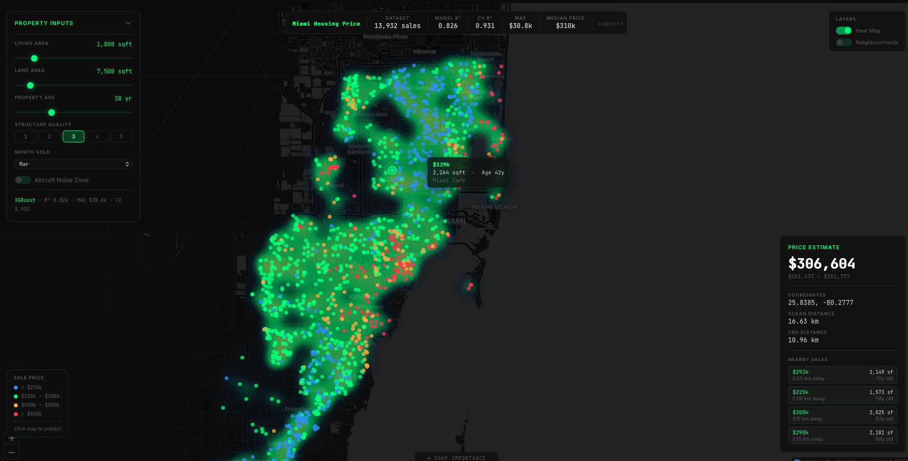

# Miami Housing Price Intelligence

[](https://miami-price-prediction.vercel.app)
[](https://github.com/sshubh4/Miami_housing/actions)
[](https://www.python.org/)
[](https://react.dev/)



**[Live Demo →](https://miami-price-prediction.vercel.app)**

A production-grade geospatial ML app that predicts real-estate sale prices across Miami-Dade County. Click anywhere on the interactive dark map to get an instant XGBoost price estimate, confidence range, and nearby comparable sales. The model is trained on 13,932 transactions with 20 engineered features and achieves R²=0.826 on held-out data and CV R²=0.931 across five folds.

---

## Architecture

```
data/miami-housing.csv
    → src/pipeline.py      (clean · validate · feature engineering)
    → src/model.py         (XGBoost · log-price target · 5-fold CV · SHAP)
    → FastAPI  (Railway)   GET /api/data  POST /api/predict  GET /api/neighbourhood-stats
    → React / Leaflet (Vercel)   dark map · heatmap · choropleth · SHAP drawer
```

---

## Model performance

| Metric | Value |
|---|---|
| R² (validation) | 0.826 |
| CV R² (5-fold) | 0.931 ± 0.002 |
| MAE | $30.8k |
| RMSE | $45.2k |
| Training samples | 13,932 |

---

## Feature engineering

| Feature | Rationale |
|---|---|
| `log_ocean_dist` | Diminishing-returns premium near the ocean |
| `log_cntr_dist` | Same for CBD proximity |
| `land_to_living` | High ratio flags underbuilt lots (land-value play) |
| `is_coastal` | Binary: property within 1 km of ocean |
| `cbd_access` | Continuous 0–1 CBD accessibility score |
| `peak_season` | Jan–May = Miami real-estate demand peak |
| `noise_penalty` | Aircraft noise × ocean distance interaction |
| `age` | Derived from effective year built |

---

## Tech stack

**Frontend** — React 18 · Vite · Leaflet.js · leaflet.heat · Recharts · CartoDB dark tiles

**Backend** — FastAPI · XGBoost · SHAP · scikit-learn · Pydantic · uvicorn

**Infrastructure** — Docker · Docker Compose · nginx · GitHub Actions · Railway · Vercel

---

## Local setup

### Docker (one command)

```bash
git clone https://github.com/sshubh4/Miami_housing.git
cd Miami_housing
docker compose up --build
# frontend → http://localhost:3000
# API docs → http://localhost:8000/docs
```

### Manual

**Backend**

```bash
python -m venv .venv && source .venv/bin/activate
pip install -r backend/requirements-backend.txt

# Train the model (skip if models/ already has .pkl and .json)
python -m src.model data/miami-housing.csv

uvicorn backend.main:app --reload
# → http://localhost:8000/docs
```

**Frontend**

```bash
cd frontend
npm install
npm run dev
# → http://localhost:5173  (Vite proxies /api → :8000)
```

### Run tests

```bash
pytest tests/ -v
```

---

## Project structure

```
Miami_housing/
├── .github/workflows/
│   └── ci.yml
├── backend/
│   ├── Dockerfile
│   ├── main.py
│   └── requirements-backend.txt
├── data/
│   └── miami-housing.csv
├── docs/
│   └── screenshot.png
├── frontend/
│   ├── Dockerfile
│   ├── index.html
│   ├── nginx.conf
│   ├── package.json
│   ├── vite.config.js
│   └── src/
│       ├── App.jsx
│       ├── api.js
│       ├── index.css
│       ├── main.jsx
│       └── components/
│           ├── Map.jsx
│           ├── PredictionCard.jsx
│           ├── PropertyPanel.jsx
│           ├── ShapDrawer.jsx
│           └── StatsBar.jsx
├── models/
│   ├── metrics.json
│   └── xgb_model.pkl
├── src/
│   ├── pipeline.py
│   └── model.py
├── tests/
│   └── test_pipeline.py
├── CONTRIBUTING.md
├── docker-compose.yml
├── requirements.txt
└── README.md
```

---

*Built by [Shubham Sharma](https://github.com/sshubh4)*
